<p align="center">
  
</p>
<br>

> Building software. Understanding systems. Solving problems.

<br>

</div>

---

## 👨‍💻 About Me

I'm a Computer Science Engineering student focused on becoming a strong software engineer through a combination of **problem solving, software development and core computer science fundamentals**.

I enjoy understanding what happens beneath abstractions — from algorithms and application architecture to networking, databases and systems.

Currently, I'm strengthening my **C++ and Data Structures & Algorithms**, building full-stack applications and gradually exploring **Artificial Intelligence and Machine Learning**.

```cpp
class Prakhar {
public:
    string role = "Aspiring Software Engineer";

    vector<string> currentFocus = {
        "Data Structures & Algorithms",
        "C++",
        "Full-Stack Development",
        "AI/ML",
        "Computer Systems"
    };

    string mindset = "Understand → Build → Debug → Improve";
};
```

---

## 🚀 Currently Exploring

* Data Structures & Algorithms with C++
* Full-Stack Web Development
* Backend development and REST APIs
* Database design and PostgreSQL
* Artificial Intelligence & Machine Learning
* Computer Networks and Systems
* Open Source Development

---

## 🧰 Technical Stack

### Languages

<p>

</p>

### Frontend

<p>

</p>

### Backend & Databases

<p>

</p>

### Developer Tools

<p>

</p>

---

## 🧠 Core Computer Science

`Data Structures & Algorithms`
`Object-Oriented Programming`
`Database Management Systems`
`Computer Networks`
`Cloud Computing`
`Virtualization`
`Software Engineering`

---

## 🚀 Featured Projects

### 🤖 AI StudyFlow Tracker

AI-powered study planning application designed to generate intelligent study plans and help users organize their learning workflow.

**Tech:** JavaScript • Node.js • Gemini API • HTML • CSS

[Repository](https://github.com/prakhardwivedi4414-pixel/Ai-Sutdyflow-Tracker)

---

### 🌱 EcoRevive

A web platform focused on sustainability and environmental awareness with an interactive user-facing experience.

**Tech:** HTML • CSS • JavaScript

[Live Demo](https://ecorevive-one.vercel.app/) • [Repository](https://github.com/prakhardwivedi4414-pixel/ecorevive)

---

### 🎬 CenimaDB

Database-oriented application built to explore structured data management and application-database interaction.

**Tech:** PostgreSQL • JavaScript • Database Design

[Repository](https://github.com/prakhardwivedi4414-pixel/CenimaDB)

---

### 🌐 Developer Portfolio

Personal portfolio showcasing projects, technical skills and software development work.

**Tech:** HTML • CSS • JavaScript

[Repository](https://github.com/prakhardwivedi4414-pixel/Portfolio)

---

## 📊 GitHub Analytics

<div align="center">


</div>

---

## 🐍 Contribution Activity

<div align="center">


</div>

---

## ⚡ Engineering Mindset

```text
Curiosity
   ↓
Understand
   ↓
Build
   ↓
Break
   ↓
Debug
   ↓
Improve
   ↓
Repeat
```

I don't just want to learn how to use technology.

I want to understand **why it works, how it works and how I can build something better with it.**

---

## 🤝 Let's Connect

I'm always interested in:

**Software Development • Open Source • AI/ML • Systems • Interesting Engineering Projects**

Feel free to explore my repositories, open an issue or connect with me professionally.

---

<div align="center">

### `while(alive) { learn(); build(); improve(); }`

</div>
<div align="center">


</div>
